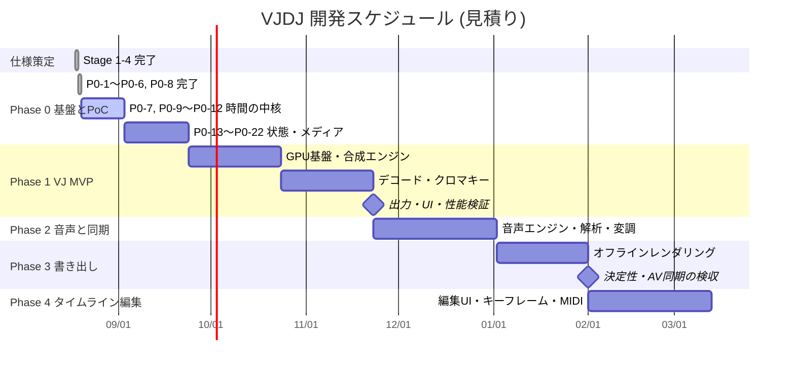

# 📊 VJDJ プロジェクト進捗レポート

**更新日時**: 2026-08-19
**現在のフェーズ**: Phase 0 — 基盤と PoC
**全体進捗**: 7.6% (7 / 92 タスク) ／ 工数ベース約 20h / 320h

> 数値だけ見ると小さいが、**進捗の中身は偏っている。**
> 完了した 7 タスクのうち 4 つが PoC で、**技術的な不確実性を先に潰す**フェーズ設計になっている。
> 設計の 3 大リスクのうち 2 つ (R-1 / R-2) はすでに解消済み。

---

## 📈 進捗状況

| 区分 | 数 |
|---|---|
| ✅ 完了 | **7** (P0-1〜P0-6, P0-8) |
| 🚧 進行中 | 0 |
| ⏳ 未着手 | 85 |

### 仕様策定 (Stage 1〜4) — 完了

| Stage | 成果物 | 状態 |
|---|---|---|
| 1 要件定義 | `.tmp/requirements.md` | ✅ |
| 2 詳細設計 | `.tmp/design.md` (確定挙動 D-1〜D-8 含む) | ✅ |
| 3 テスト設計 | `.tmp/test_design.md` (約 300 ケース) | ✅ |
| 4 タスク分解 | `.tmp/tasks.md` (92 タスク) | ✅ |

### Phase 0 の内訳 (22 タスク中 7 完了)

| ID | タスク | 状態 | 結果 |
|---|---|---|---|
| P0-1 | プロジェクト初期化 | ✅ | 規約違反が lint で落ちることを実測確認 |
| P0-2 | プラットフォーム能力 PoC | ✅ | PC001 / PC008 ともに PASS |
| P0-3 | 2 ウィンドウ + MessageChannel | ✅ | S001-R **100/100** 成功 |
| P0-4 | プレビュー転送 PoC | ✅ | PC002 PASS、ImageBitmap 採用確定 |
| P0-5 | 音声デバイス能力 PoC | ✅ | PC003 完了、キューはスコープ外に |
| P0-6 | テスト基盤 | ✅ | 3 層すべて稼働 |
| P0-8 | 単位型 | ✅ | branded type、PPQ=960 |
| P0-7 | テストデータ生成 | ⏳ | 次の着手候補 |
| P0-9〜12 | TempoMap / Transport | ⏳ | **最重要**。PoC 知見 2 件の組み込み必須 |
| P0-13〜17 | 状態管理・永続化 | ⏳ | |
| P0-18〜20 | FFmpeg パイプライン | ⏳ | |
| P0-21, 22 | エラー基盤・セキュリティ | ⏳ | |

### PoC 進捗 (8 項目中 4 決着)

| ID | 内容 | 状態 |
|---|---|---|
| PC001 | WebGPU 可用性 | ✅ PASS |
| PC002 | ImageBitmap 転送 | ✅ PASS |
| PC003 | 出力チャンネル数 | ✅ 完了 (スコープ外で確定) |
| PC008 | 背景スロットリング | ✅ PASS |
| PC004 | 多レイヤーデコード | ⏳ P1-24 |
| PC007 | VRAM 上限 | ⏳ P1-24 |
| PC005 | ストレッチ CPU 負荷 | ⏳ P2-16 |
| PC006 | 30 分 A/V ずれ | ⏳ P2-16 |

### テストの現況

| 層 | コマンド | 件数 | 実行時間 |
|---|---|---|---|
| 1 純ロジック | `npm run test` | 9 | **366ms** (上限 30 秒) |
| 2 GPU | `npm run test:gpu` | 3 | 約 5 秒 |
| 3 音声 | `npm run test:audio` | 3 | 約 3 秒 |

---

## 🎯 次のタスク (優先度順)

1. **P0-9, P0-10 — TempoMap / TempoIndex** (7h)
   tick ⇄ 秒の変換。ここが壊れると全機能が壊れるため最優先。プロパティテスト TMP01〜08 が合格ゲート。
2. **P0-11, P0-12 — ClockSource / Transport** (7h)
   アンカー方式。**PoC で判明した罠 2 件 (較正確立待ち / ジッタ平滑化) の組み込みが必須。**
   型と `FakeClockSource` には既に埋め込み済みなので、実装が対応していなければテストで落ちる。
3. **P0-7 — テストデータ生成スクリプト** (3h)
   FFmpeg で `sync_marker.mp4` 等を生成。P0-18 以降と Phase 3 の検証で必要。
4. **P0-13〜P0-17 — 状態管理** (17h)
   zod スキーマ → ProjectStore → Undo → JSON Patch → IPC → 永続化。
   `immer` の `produceWithPatches` で逆パッチを得られる可能性があり、P0-14 着手時に評価する。

Phase 0 は 3 系統 (時間系 / メディア系 / 状態系) が独立して進むため、詰まったら別系統へ移れる。

---

## ⚠️ 注意事項

### ブロッカー

**なし。**次のタスクはすべて着手可能。

### 判断待ち

- **Git 管理下にない。**リポジトリ未初期化のため版管理も pre-commit フックも未設定。
  すでに 40 ファイル規模で Phase 1 でさらに増える。`git init` の可否をユーザーに確認中。

### 設計書に未反映の実測知見 (10 件)

`.tmp/poc-results.md` の「設計書へ反映すべき事項」に列挙済み。実装時に効くもの:

| # | 内容 | 効く場所 |
|---|---|---|
| 8 | `contextTime > 0` を確認してから較正を確立する (起動後 65ms は `{0,0}` が返る) | **P0-11 必須** |
| 9 | 較正値をローパスフィルタで平滑化する (単発は最大 10ms のジッタ) | **P0-11 必須** |
| 1 | `maxBindGroups` が 4。バインドグループ設計をこの数に収める | P1-3 |
| 4 | 2 画面目の scaleFactor が 1.5。`devicePixelRatio` 込みで canvas サイズを決める | P1-19 |
| 2 | `timestamp-query` が使える。性能計測を GPU 実時間で行える | P1-25 |
| 7 | プレビュー解像度の既定を上げてよい (1080p でも engine 側 0.4ms) | P1-20 |

8 と 9 は設計書に記載がなく、実測で初めて判明した。
入れ忘れると「なぜか音とずれる」「たまにカクつく」という原因特定の難しい不具合になる。

### リスク

| # | リスク | 状態 |
|---|---|---|
| R-1 | プレビュー転送がボトルネックになる | ✅ **解消** (PC002) |
| R-2 | Web Audio でヘッドホンキューを実現できない | ✅ **解消** (スコープ外に確定) |
| R-3 | タイムストレッチの CPU 負荷 | ⏳ PC005 待ち |
| R-4 | 多レイヤー再生でデコードが破綻 | ⏳ PC004 待ち。BC 圧縮対応済みのため HAP 導入の余地あり |
| R-5 | VST 非対応による音作りの制約 | 受容済み |
| R-6 | **3 つの柱を作り切れず中途半端に終わる** | 継続監視。Phase 1 単体、Phase 3 完了時点で価値が出る構成 |
| R-7 | ライセンス | 個人利用のため問題なし |

**R-6 が引き続き最大のリスク。**Phase 1 (VJ MVP) まで到達すればクロマキー合成ツールとして成立し、
Phase 3 まで行けば書き出しも揃う。この 2 点が中間ゴール。

---

## 📅 Gantt Chart

> 週 15 時間の作業を仮定した見積り。工数は集中作業時間ベースで、調査・試行錯誤を含まない。
> WebGPU / WebCodecs / AudioWorklet は初見の箇所で 1.5〜2 倍かかることを見込むこと。

---

## 📦 再実行できる検証

| コマンド | 内容 |
|---|---|
| `npm run verify` | lint + typecheck + 層 1 テスト |
| `npm run test:all` | 層 1〜3 すべて |
| `npm run test:handshake` | S001-R 100 回連続起動 (要 `npm run build`) |
| `npm run poc:platform` | PC001 / PC008 再測定 |
| `npm run poc:preview` | PC002 再測定 |
| `npm run poc:audio` | PC003 再測定 (オーディオIF 導入時) |
